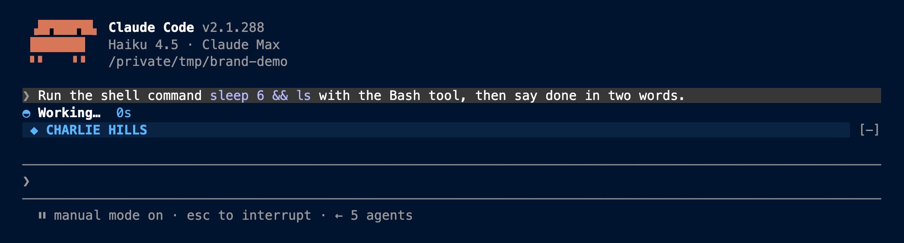
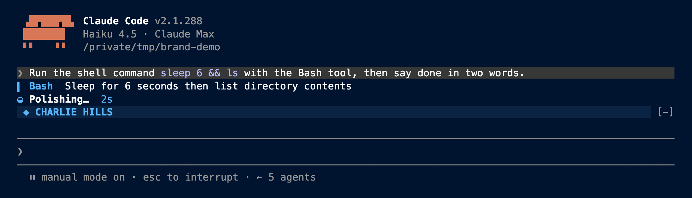
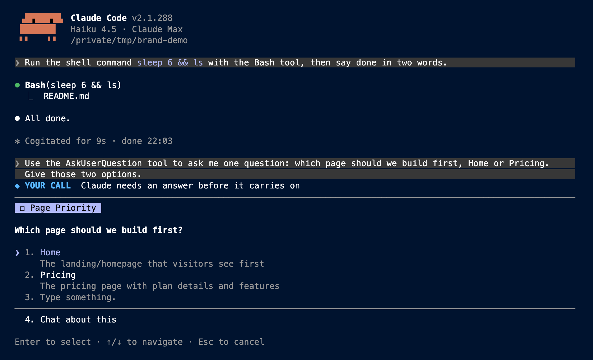
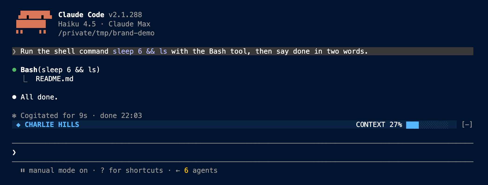

# Mod Maker (free)

Mod Maker finds what you ask Claude Code again and again, then builds a mod so you never ask again.

The pack holds Mod Maker, 11 example mods and a virtual office. All 118 automatic tests pass (118/118).

A mod changes Claude Code itself: a pane, a status line, a guard before a command. It runs on its own. You don't have to remember it.

## Install (3 commands)

You need Claude Code 2.1.287 or newer. Run these in your terminal:

```
claude plugin marketplace add charlie947/mod-maker
claude plugin install mod-maker@charlie-free-mods
claude plugin install safe-delete@charlie-free-mods
```

Then restart Claude Code. Add any other mod below the same way: `claude plugin install <name>@charlie-free-mods`.

Downloaded the folder instead? Point the marketplace at it. I tested this on a blank copy of Claude Code first (folder path shortened):

```
$ claude plugin marketplace add /path/to/mod-maker-pack
✔ Successfully added marketplace: charlie-free-mods
$ claude plugin install mod-maker@charlie-free-mods
✔ Successfully installed plugin: mod-maker@charlie-free-mods (scope: user)
```

**Trust first.** A mod runs code on your computer. Every mod here is a few short files you can read. Before you install anyone's mod (mine included), run `/mod-check <folder>` and read what it can do.

## Mod Maker: 4 parts

1. **/mod-audit** reads the prompts you typed in your last 30 sessions and ranks what you ask again and again, with real counts. Your prompts never leave your computer.
2. **/mod-build 2** builds a mod for item 2 on that list. It asks Claude to use Claude Code's own mod-writing skill, write a test and check the mod passes.
3. **/mod-check <folder>** says in plain English what a mod can read, run and send, before you trust it.
4. **The habit spotter** is always on. The third time you ask the same thing in one session, a bar above your prompt asks: "Make it a mod?"

## 11 example mods

| Mod | What it does | Status |
|---|---|---|
| mission-control | A live panel above your prompt. The plan fills as a bar, a line says what Claude is doing in plain English, your asks tick off, and a chime and a "Done" banner play when it finishes. | watched live |
| safe-delete | When Claude deletes files, they go to the Bin instead. You get a receipt, and `/undo-delete` puts the last batch back. | watched live |
| secrets-guard | Stops Claude opening your .env and key files, and hides API keys if one shows up in a command's output. | tested only |
| open-loops | A pane that lists every ask you make in a session. Claude can only tick one off with proof. | watched live |
| show-it | When Claude makes a page, image or video, it opens by itself in the background. `/show` brings it to the front. | tested only |
| sessions-band | A bar above your prompt that lists your other open Claude Code sessions, with an Ask button. | tested only |
| pre-build-check | Before Claude builds anything, it re-reads your own CLAUDE.md rules. A reference gives the structure, never the look. | tested only |
| done-ping | A desktop notification with a sound when Claude finishes a long answer or may need your OK. | tested only |
| plain-reply | Grades every reply for length, long sentences and jargon. Over your bar, a "Say it simpler" button puts a rewrite request in your prompt box. You press Enter. | tested only |
| outbox | Holds every message Claude tries to send (WhatsApp, email, Slack). You see the full text, every recipient and every attachment, then press Send, Edit or Hold. Nothing leaves until you press Send. | tested only |
| brand-theme | Dresses Claude Code in your brand. The spinner, the tool Claude is running and the question dialog take your colours, and a band above the prompt shows your name, open loops and how full the context is. | watched live |

## The virtual office

`office` turns your sessions into a pixel-art office in your browser. Each Claude Code session gets a desk with a name tag. You see what it is doing, the files it touched, notes flying between sessions, and a "Done by" clock that re-estimates from the real time each step takes. It chimes when a long answer finishes. Type `/office` for the page link and `/desk Writer` to name your desk. The page is a local file, so nothing leaves your computer.

Install it like the others: `claude plugin install office@charlie-free-mods`. Status: tested only.

"Watched live" means I saw it work in a real Claude Code session. "Tested only" means its automatic tests pass but I haven't watched it work in a real session yet.

## What safe-delete does not catch

Safe-delete catches the delete commands Claude types: `rm`, `rm -r`, `rm -rf`, `find -delete` and `git clean`. It does **not** catch a delete hidden inside a script Claude runs (like `bash cleanup.sh`), or a delete you run yourself. It works on macOS and Linux. On Windows it stops the delete and asks you to do it by hand.

## What mission-control does not do yet

In a short terminal window, an open pane (like the open-loops list) takes the space above the prompt, so the mission-control panel does not show. Close the pane, or use mission-control on its own: it keeps its own list of your asks.

## brand-theme: make it yours

All the colours sit in one block at the top of `plugins/brand-theme/hooks/theme.ts`. Change the six values and the name, and the mod draws in your brand. The default is the charliehills.ai palette: navy `#00132F`, panels `#0A2342`, hairlines `#1C3A5E`, and one sky signal `#58B6FF`.

| Spinner | Running tool | Question dialog | Band |
|---|---|---|---|
|  |  |  |  |

The screenshots come from a real Claude Code 2.1.288 session with the mod loaded.

**What it cannot change.** Your terminal app paints the background behind Claude Code, not the mod. To make the whole window navy, set your terminal's background to `#00132F`. In most terminals (iTerm2, Ghostty, kitty, WezTerm) this one line does it for the open window:

```
printf '\e]11;#00132F\a'
```

To keep it, put `background = #00132F` in Ghostty's config, or set the colour in your terminal's profile. Then run `/theme` in Claude Code and pick a dark theme, so its own text stays readable on navy.

The mod also cannot repaint the Claude mascot in the logo, the permission prompt, or finished tool rows (they keep Claude Code's own colours so a red error stays red). The open loops count shows only when the open-loops mod is installed. The Desktop app keeps its own look.

## Settings (optional)

- `MOD_AUDIT_SESSIONS=50` reads 50 sessions instead of 30.
- `PRE_BUILD_RULES=/path/a.md:/path/b.md` picks your own rule files.
- `DONE_PING_AFTER_SECONDS=60` only pings for answers longer than a minute.
